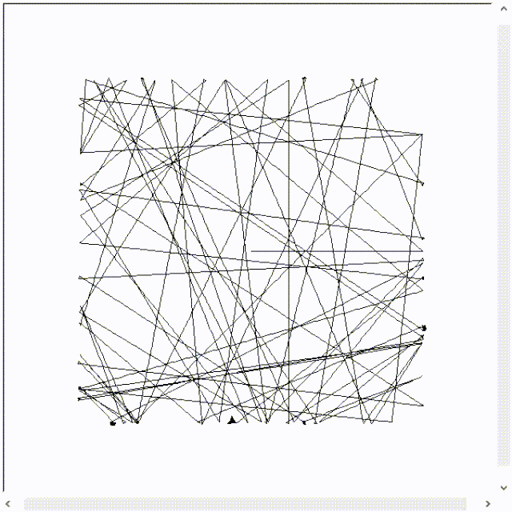
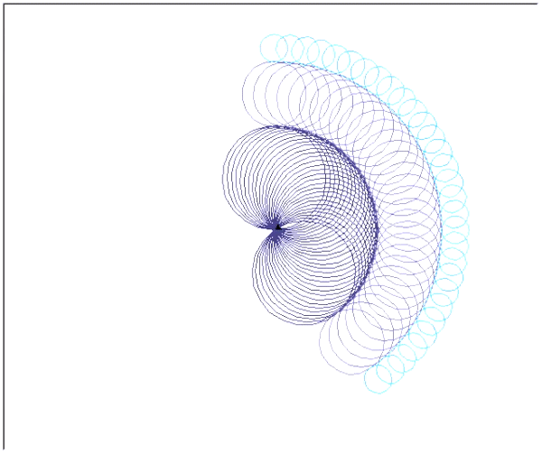
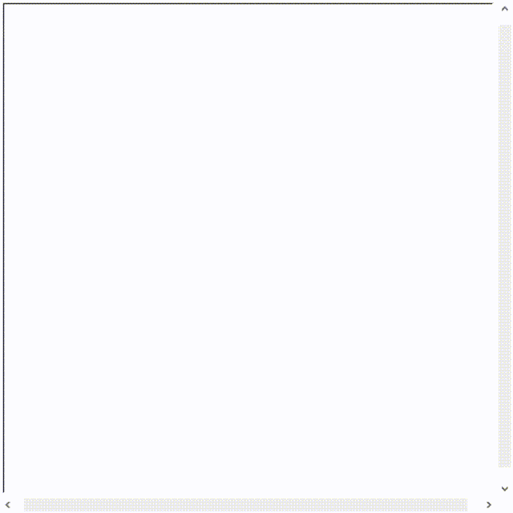
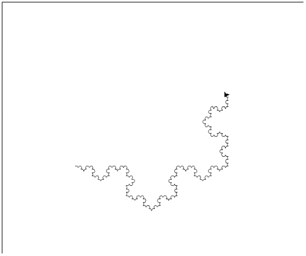
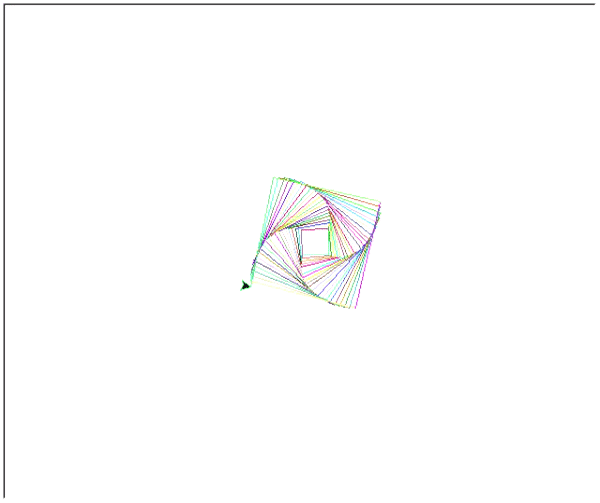

# Fractals and other things with the Python Turtle
Alle Dateien wurden in Phyton 3.8 geschrieben.
 
Mehr zu Fraktalen finden Sie [hier](https://de.wikipedia.org/wiki/Fraktal).

## Abstract Art

Ein einfaches Programm welches die Turtle hin- und herlaufen lässt. Dies geschieht in einem Bereich von -200 < x < 200 und -200 < y < 200.
 

Erreicht die Turtle die Grenzwerte so wird sie mit einem zufälligen Wert gedreht und geht 3 Schritte vorwärts. Dadurch kann es dazu kommen, dass die Turtle im Grenzwert stecken bleibt und sich dort aufhängt, wodurch kleine schwarze Punkte im Grenzwert entstehen können, wie im Bild erkennbar sind.
 

Die Werte können selbstverständlich im Script geändert werden.
 
 

## Circle

 
 
 
 
 
 
 
 
 

## Fibonacci

Die [Fibonacci-Folge](https://de.wikipedia.org/wiki/Fibonacci-Folge), in der Turtle dargestellt mit Vierecken.
 

Sie wurde von Leonardo Fibonacci, im Jahr 1208, entdeckt. Sie war allerdings auch schon in der Antike den Griechen und Indern bekannt. Zudem hat die Folge einen starken Zusammenhang mit dem [Goldenen Schnitt](https://de.wikipedia.org/wiki/Goldener_Schnitt).
 

Die Fibonacci-Folge besteht im Wesentlichen daraus, dass der neue Wert n aus den vorherigen Werte summiert wird. In diesem Beispiel, der Flächeninhalt des neuen Vierecks, ist der Flächeninhalt des Vierecks davor, summiert mit dem Flächeninhalt zwei davor. In der folgenden Tabelle leicht dargestellt.
<table>
  <tr>
    <th>Schritt</th>
    <th>1</th>
    <th>2</th>
    <th>3</th>
    <th>4</th>
    <th>5</th>
    <th>6</th>
    <th>7</th>
    <th>8</th>
    <th>9</th>
    <th>10</th>
  </tr>
  <tr>
    <th>Flächeninhalt</th>
    <th>0</th>
    <th>1</th>
    <th>1</th>
    <th>2</th>
    <th>3</th>
    <th>5</th>
    <th>8</th>
    <th>13</th>
    <th>21</th>
    <th>34</th>
  </tr>
</table>
 

## Sierpinskie Fractal

Das Sierpinski Dreieck ist unter anderem ein recht einfaches Fraktal, welches die Eigenschaft sehr anschaulich vermittelt.
 

Man nehme ein Gleichschenkliges und Gleichseitiges Dreieck und erzeuge damit in dem Dreieck wieder 4 neue Dreiecke, durch 3 einfache Striche. Diese Dreiecke sind ebenfalls wieder gleichschenklig und gleichseitig und deswegen kann man diesen Schritt unendlich oft wiederholen. Das folgende wird in dieser [Grafik](https://upload.wikimedia.org/wikipedia/commons/2/27/SierpinskiTriangle-ani-0-7.gif) leicht veranschaulicht. Durch diesen Prozess wird die Eigenschaft der Selbstähnlichkeit und der unendlichen Wiederholbarkeit gewährt.
 

Die Iterationstiefe kann im Script manuell festgelegt werden, wenn man die Variable l verändert. Es ist allerdings zu beachten, dass bei einem Wert größer 600 und einer Windowsize von x = 300 und y = 300 die Turtle nicht mehr erkennbar ist.  
Dies geschieht deshalb, weil die Turtle nicht in die tiefe iteriert sondern nach oben   und somit das Dreieck immer größer wird.

## Snowflake

Die Kochkurve durch die Python Turtle dargestellt.
 

Die Kochkurve ist ein recht einfaches Fraktal welches sich auch leicht erklären lässt. Man nimmt eine Strecke x und teilt diese in drei gleiche Stücke. In dem zweiten Teil der Strecke wird ein gleichschenkliges Dreieck aufgesetzt, wobei die Seiten des Dreiecks genau so lang sind wie die zwei restlichen Drittel. Dies wird in dieser [Grafik](https://upload.wikimedia.org/wikipedia/commons/6/6f/How_to_make_Koch_curve.svg) nochmal veranschaulicht. Diesen Prozess kann man dann mehrmals wiederholen. Durch diese recht einfachen Schritten entsteht die Kochkurve. 
 
 
 

## Spiral

 
 
 
 
 
 
 
 
 

## Square Spiral

Ein einfaches Fraktal welches stark dem Goldenen Schnitt ähnelt.
 

In diesem Beispiel wird das Fraktal durch mehrere Vierecke erzeugt, die jeweils immer um 5° nach links verschoben werden und zusätzlich die Länge um 5 Einheiten erhöht wird. Durch die Überlappungen an den Enden kommt es dazu, dass der Goldene Schnitt erkennbar ist.
 

Wie oft ein Viereck gezeichnet werden soll kann manuell im Script geändert werden. Aktuell ist der Wert auf 60, dadurch wird ein Großteil des GUIs ausgefüllt, wie im GIF erkennbar ist.
 

## Star

Ein einfacher Stern, keine weitere Besonderheit.
 

Wie viel zacken der Stern haben soll kann im Script verändert werden, indem man den Wert verändert, wie stark sich die Turtle nach links bewegen soll.
 
 
 
 
 
 
 

## Tree

Ein Fraktal, ähnlich wie der Pythagoras Baum, nur hier in etwas abgeänderter Form.
 

Der Pythagoras Baum wird dadurch erzeugt, dass auf einem Viereck ein rechtwinkliges Dreieck aufgesetzt wird, wobei die Hypotenuse des Rechtecks, die Kante des Vierecks ist. Auf den Katheten wird dann wieder ein Viereck erzeugt und darauf wieder ein rechtwinkliges Dreieck. Dieser Vorgang kann unendlich oft wiederholt werden. 

Das ganze wird in diesem [Bild](https://upload.wikimedia.org/wikipedia/commons/b/b9/Pythagoras_tree_construct_5of5.png) nochmal veranschaulicht.
